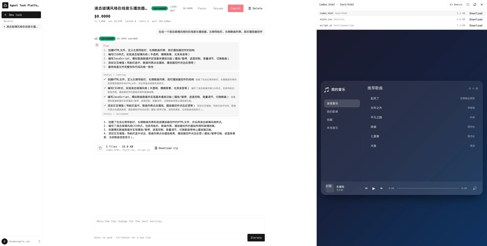
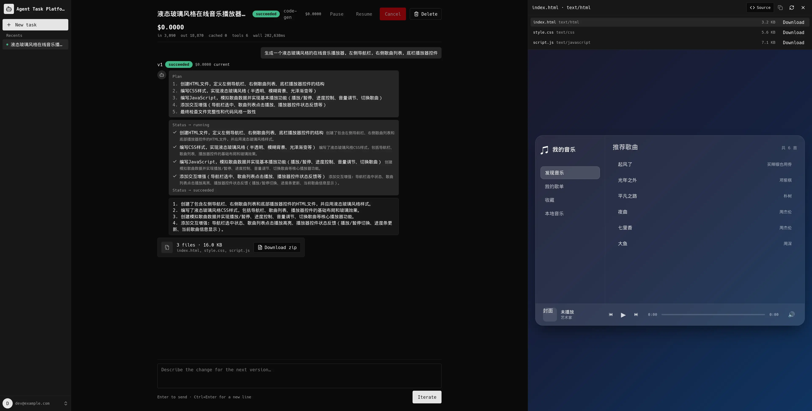

# agent-example

一个面向 LLM Agent 任务的多用户平台示例：用户在前端提交任务 → 后端编排 → Worker（基于 LangChain `deepagents`）执行 → 持续迭代/版本化，并提供成本统计、实时观测、暂停/取消/回滚等能力。

> 本仓库是一个**完整可运行的 MVP**：前端（`web/`）、后端 API（`api/`）、Worker（`worker/`）三端均已实现，
> 通过 OpenSpec 工作流逐模块落地。整体方案见 [`docs/ARCHITECTURE.md`](docs/ARCHITECTURE.md)，
> 本地一键起栈与端到端联调见 [`docs/DEVELOPMENT.md`](docs/DEVELOPMENT.md)。
>
> 本仓库同时是一个 **AI 编码代理协作的示例工程**：全部功能通过 Claude Code / Copilot 在 OpenSpec
> 工作流下逐步实现，演进过程完整记录在 [`docs/HISTORY.md`](docs/HISTORY.md)。

## 界面预览

三栏式布局（导航 / 对话流任务详情 / Artifact 预览），支持明暗双主题：

| Light | Dark |
|---|---|
|  |  |

## 仓库结构

```
.
├── docs/                    # 文档（架构、历史、本地开发说明、截图）
│   ├── ARCHITECTURE.md      # 生产级架构设计方案（MVP / Post-MVP 标注）
│   ├── DEVELOPMENT.md       # 本地开发环境启动说明（依赖栈 + 各模块编排）
│   ├── HISTORY.md           # 项目演进历史 / 每轮迭代的用户原始诉求
│   └── images/              # README 截图
├── web/                     # 前端：React 19 + TypeScript + Vite + shadcn/ui
├── api/                     # 后端 API：Golang + Gin + pgx + sqlc
├── worker/                  # Worker：Python 3.14 + deepagents
├── openspec/                # OpenSpec 规格与变更提案
│   ├── changes/archive/     # 已落地并归档的变更（proposal / design / tasks）
│   └── specs/               # 已沉淀的规格（specs）
├── docker-compose.dev.yml   # 本地依赖栈（Postgres / RabbitMQ / Redis / SeaweedFS / Jaeger）
├── AGENTS.md                # 给 AI 编码代理的协作指南
├── CLAUDE.md                # Claude Code 入口，指向 AGENTS.md
└── README.md
```

## 技术栈一览

| 层 | 选型 |
|---|---|
| 前端 | React 19 + TypeScript（strict）+ Vite + TailwindCSS + shadcn/ui + Zustand + TanStack Query |
| 后端 API | Golang（Gin + pgx + sqlc + golang-migrate + amqp091） |
| Worker | Python 3.14 + LangChain `deepagents`（aio-pika + asyncpg + aioboto3） |
| 数据库 | PostgreSQL |
| 对象存储 | OSS（S3 兼容；本地用 SeaweedFS） |
| 消息队列 | RabbitMQ |
| 缓存/PubSub | Redis（控制信号 fast-path） |
| 鉴权 | JWT（HS256，MVP 单 dev 账号） |
| 可观测 | OpenTelemetry + Prometheus（+ 可选 Jaeger） |

详细模块划分、数据模型、接口契约、交互流程见 [`docs/ARCHITECTURE.md`](docs/ARCHITECTURE.md)。

## 核心特性（MVP 范围）

- **任务全生命周期**：创建 / 执行 / 暂停 / 恢复 / 取消 / 完成 / 迭代 / 回滚
- **单 task 连续对话**：同一 task 维持一份对话历史、上下文与产物目录，迭代基于既有内容继续
- **任务级互斥**：同一 task 同一时刻最多一个活跃版本（DB 唯一部分索引兜底，API 返回 `409`）
- **任务成本统计**：按 token、tool 调用、wall-time 计费，沉淀到 version / task 两级，前端可见
- **故障恢复**：Outbox + 幂等消费 + Checkpoint + 心跳/Reaper
- **实时观测**：WebSocket 实时事件流，失败降级为轮询
- **产物管理**：执行产物上传 OSS，经 API 下载反向代理预览/下载（支持目录关联资源、富渲染）
- **鉴权**：JWT 中间件保护 `/api/v1/*`，前端登录态持久化
- **Worker 插件机制**：Tool / Subagent 两类扩展点，`plugin.yaml` 声明、启动期自动注册（Skill 留到 Post-MVP）
- **现代化前端**：shadcn/ui 三栏外壳、对话流任务详情、Artifact 卡片预览、明暗双主题切换

## 快速开始

前置工具与完整步骤见 [`docs/DEVELOPMENT.md`](docs/DEVELOPMENT.md)。最短路径：

```sh
# 1. 起依赖栈（Postgres / RabbitMQ / Redis / SeaweedFS）
docker compose -f docker-compose.dev.yml up -d

# 2. 后端 API（另见 api/README.md 配置环境变量）
cd api && go mod download && make migrate-up && make run

# 3. Worker（另开终端，fake model 无需 API key 即可跑通闭环）
cd worker && make sync && make run

# 4. 前端（另开终端）
cd web && npm install && npm run dev   # http://localhost:5173
```

打开 `http://localhost:5173`，用 `AUTH_DEV_EMAIL` / `AUTH_DEV_PASSWORD` 登录，
在 `/tasks/new` 提交任务并在详情页观察实时事件流与产物。

各模块的命令、配置与实现细节见对应子目录 README：
[`api/README.md`](api/README.md)、[`worker/README.md`](worker/README.md)、[`web/README.md`](web/README.md)。

## 开发工作流

本项目使用 [OpenSpec](https://github.com/openspec/openspec) 管理"非 trivial 变更"：

1. **提案**：`/opsx:propose <change-name>` 产出 proposal / design / tasks 三件套
2. **应用**：`/opsx:apply <change-name>` 按 tasks 落地代码
3. **归档**：`/opsx:archive <change-name>` 把变更沉淀到 `openspec/specs/`

已落地的变更归档在 `openspec/changes/archive/`，沉淀规格在 `openspec/specs/`。
完整的代理协作约定见 [`AGENTS.md`](AGENTS.md)。

## 延伸阅读

- 架构设计：[`docs/ARCHITECTURE.md`](docs/ARCHITECTURE.md)
- 本地开发：[`docs/DEVELOPMENT.md`](docs/DEVELOPMENT.md)
- 项目历史：[`docs/HISTORY.md`](docs/HISTORY.md)
- 代理协作：[`AGENTS.md`](AGENTS.md)
- OpenSpec 规格与归档：`openspec/specs/`、`openspec/changes/archive/`
